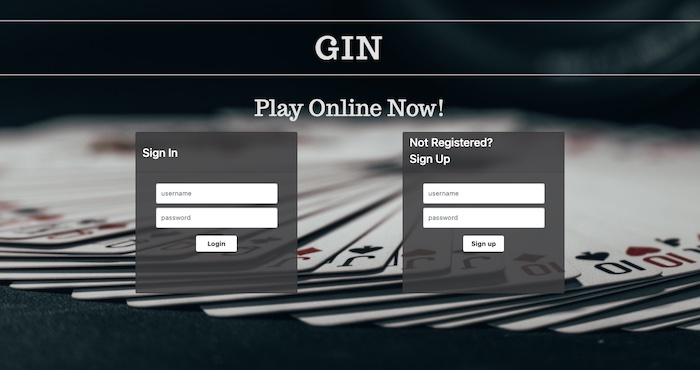
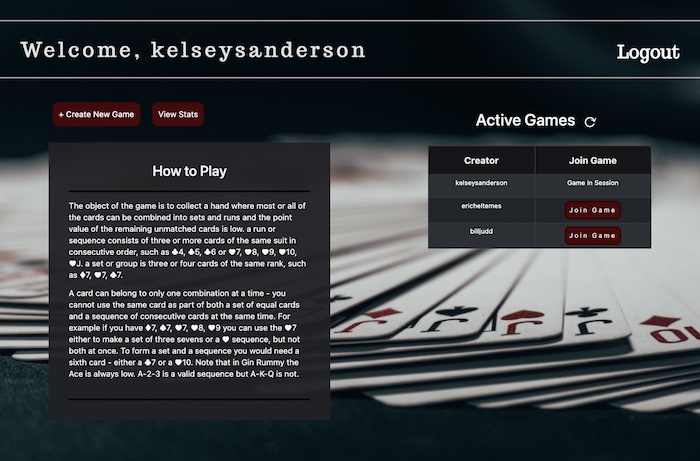
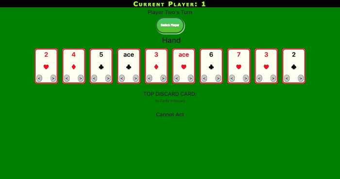

# Gin

## Table of Contents
* [Description](README.md#Description)
* [Installation](README.md#Installation)
* [Usage](README.md#Usage)
* [URL](README.md#URL)
* [Contributors](READ.md#Contributors)
* [License](README.md#License)
* [Questions](README.md#Questions)

## Description
An app developed using the MERN stack. A user can login and play a game of gin rummy with another online player using websockets. The user will also be able to view their past game statistics.

## Installation
To install, clone this from my repository by entering `git clone https://github.com/rashidk83/project3.git` in a terminal in a new directory. Then, when successfully cloned, cd into the new folder and type `npm install`.

## Usage
Following installation, type `npm start` into the terminal in the newly created directory. This will open up the project locally in your browser. Make sure socket listener on line 10 of client/src/pages/Games/js is not commented out, and comment out line 11. Additionally there is a switch player button on lines 145 - 148 and 779 which can be helpful for testing.

### Screenshot 

## URL
[Live URL to Gin]()

## Contributors
* Henry Kariuki [Github](https://github.com/rashidk83) [Email](mailto:kariukihenry83@gmail.com)
* Kelsey Sanderson [Github](https://github.com/kelseysanderson)  [Email](mailto:kelseyschreifels@gmail.com)
* Eric Heltemes [Github](https://github.com/erheltemes)  [Email](mailto:e.heltemes83@gmail.com)
* Bill Judd [Github](https://github.com/stack-gunnar)  [Email](mailto:juddwilliam13@gmail.com)

## License
Read more about the license here:
https://opensource.org/licenses/MIT

### Questions
If you have any questions, feel free to contact the contributors.